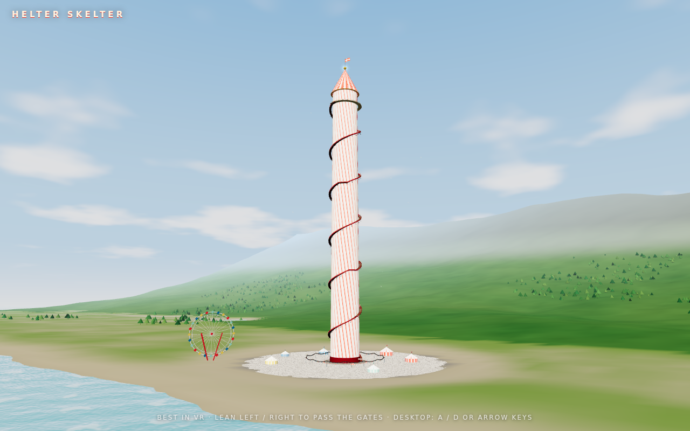
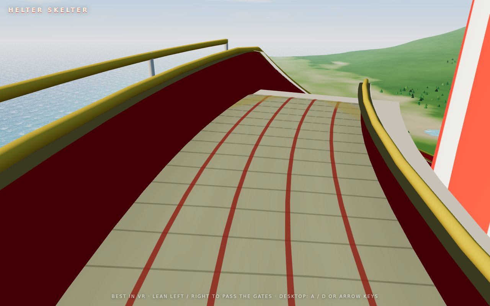
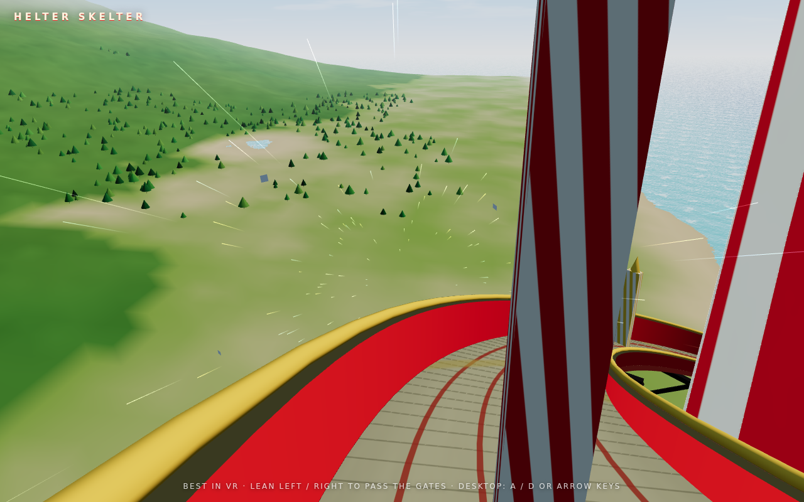

# HELTER SKELTER — VR Ride

Ride a gigantic seaside helter skelter in VR. Built on Meta's
[Immersive Web SDK](https://developers.meta.com/horizon/documentation/web/immersive-web-sdk/)
(IWSDK + Three.js + WebXR), it takes the sliding mechanics from
[DOWN](https://github.com/yellkell/down) — the eased launch, the 20 m/s
descent, leaning between the barriers, the hard stop and shockwave at every
landing — and wraps them around a 300-metre candy-striped tower on a
sunny stretch of coast.

You start on the balcony at the top. The slide spirals around the tower in
three tiers, stopping on a landing bay between each so you can catch your
breath before the next drop. Gates stand across the lanes on the way down;
lean left or right with your real body to slip past them. Clip one and
you're off the ride. Make it to the bottom and the fair is waiting.

| The tower | Start | The gates |
| --- | --- | --- |
|  |  |  |

## How to play

- **Landing page**: press **ENTER VR** to put on the headset (auto-detected),
  then **TAKE THE SLIDE** on the in-VR lobby panel (button or trigger). Or
  **RIDE IN BROWSER** to ride on desktop.
- **Best in VR** (Quest browser or any WebXR headset). Clear a **2m × 2m**
  space and stand at its centre — you dodge with your real body.
- **On the slide**: lean left / centre / right to pass the gates. The rig
  turns with the spiral, so left and right always mean your left and right.
- **Landings**: a 3-2-1 count on each bay, then the next tier launches.
- **Desktop**: **A / D** or the **arrow keys** lean. **Enter** or **Space**
  starts and retries.

URL flags: `?calm` rides at two-thirds speed for a gentler spin, `?ghost`
turns the gates into scenery so nothing can stop you, `?turbo` shortens the
landing holds, and `?view=wide` / `?view=fair` park the desktop camera out
on the coast or down on the plaza.

## Run it

```bash
npm install
npm run dev        # Vite + HTTPS (mkcert) + IWER emulator on :8082
NO_HTTPS=1 npm run dev   # plain http://localhost:8082 (no cert download)
npm run typecheck
npm run build      # production build to dist/
npm run preview    # serve the production build
```

- HTTPS matters when testing on a headset over LAN; plain HTTP is fine for
  `localhost`.
- On desktop, the dev server injects the **IWER** emulator so you can fake a
  Quest 3 (move the headset in the dev panel to lean).
- Pushes to `main` build and deploy to GitHub Pages via
  `.github/workflows/deploy.yml` (enable Pages → GitHub Actions in the repo
  settings once).

## Project layout

```
index.html          landing shell + loading screen
src/
  index.ts          world bootstrap: environment, panels, systems
  constants.ts      all tuning in one place (tower, helix, gates, palette)
  state.ts          shared game state + tiny event bus
  audio.ts          soundtrack + stingers (HTMLAudio)
  ride/path.ts      the helix: arc-length → position / heading, per tier
  systems/          ECS systems: slide rider, game referee, environment
  env/              the world: sky, terrain, sea, tower, track, fairground, fx
ui/                 UIKitML spatial panels (start / HUD / warning / end)
public/audio        the DOWN soundtrack and voice lines
```

## What came from DOWN, and what changed

DOWN's slide is a straight 32° line; its `SlideSystem` integrates speed × dt
along that line, eases the launch over 1.2 s, then runs flat out into a hard
stop with an arrival shockwave. The barriers are 0.42 × 2.6 m slabs on three
lanes spread to ±0.5 m, in the same lane patterns per difficulty, and the
head-vs-box collision test is unchanged.

Here the line is a helix. `ride/path.ts` parametrises the whole slide by arc
length — a flat run-up on each bay, the descending spiral, a short flat
arrival strip — and the slide system samples it every frame, placing the
rig's floor on the slide bed and yawing the rig to face downhill. Gates are
placed along the same path and tested in their own local frame, so the same
lean-between-the-boards rule holds as the spiral turns. The wind streaks are
DOWN's too, raked down the 26° pitch of the slide.

Everything else is new and procedural: a Rayleigh-ish sky with drifting
fbm clouds and a real sun, a heightfield coast with sand, downs, a chalk
ridge and 1,100 instanced trees, an animated sea with fresnel and sun
glitter, the striped tower with its balcony, landing bays, brackets and
flag, and a fair at its foot — tents, a turning big wheel, bunting,
umbrellas, gulls, and a paved plaza with a red ring where the slide runs out.

A note on comfort: the rig rotates continuously on the spiral (about 55°/s
at full speed). That's the ride, but it is more intense than DOWN's straight
drops — `?calm` is there for a reason.
